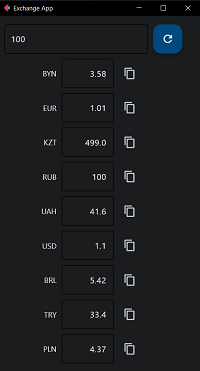

# Конвертор валют на flet

Flet — фреймворк, предоставляющий Flutter компоненты для разработки кроссплатформенных приложений на вашем любимом языке программирования Python.

Вводимое число - количество рублей, при нажатии на кнопку, все значения обновляются.

## Todo
1. [ ] автообновление значений
2. [ ] ввод значения в любой валюте
3. [ ] выбор нужных валют